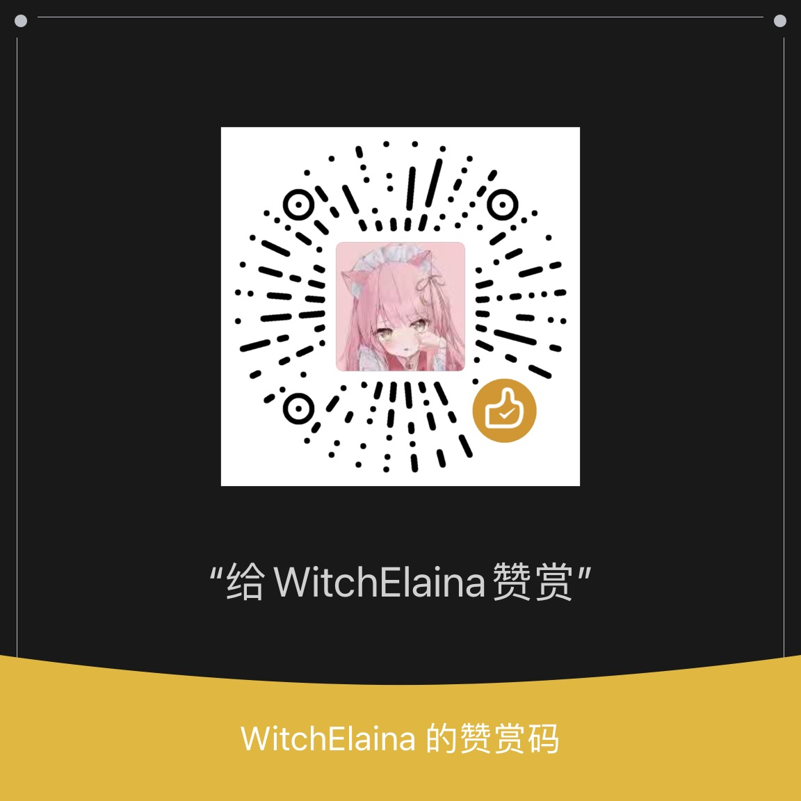

# USTB Engintime OS Lab 3.0


USTB 操作系统EOS实验

## 仓库说明

```
Docs    文档合集
Labs    实验源代码
Scripts 自动化脚本

OS-lab.code-workspace   VS-Code工作区文件
README.md   
```

具体可以前往对应文件夹查看子README文件

## 赞赏

If the repo really helps, you can give me a cup of coffee :)

<div>

</div>